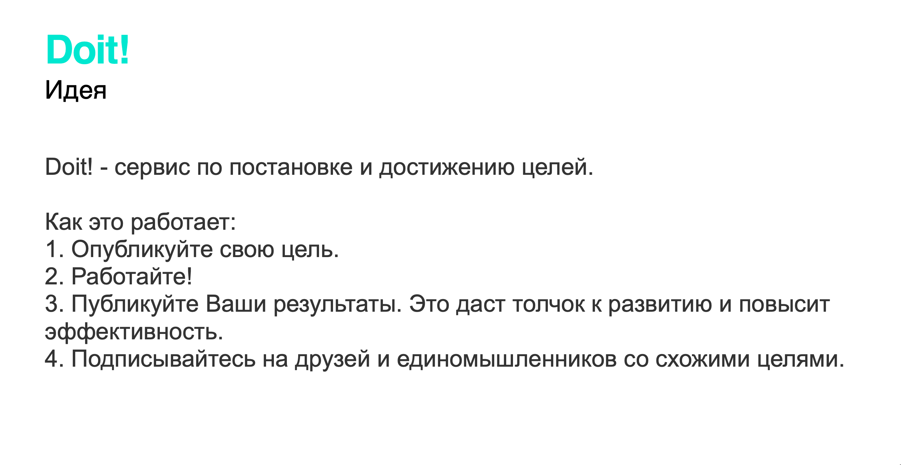
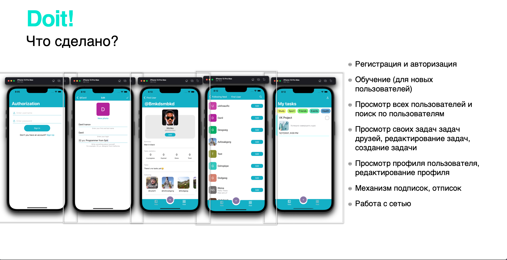

# DoIt

Приложение разрабатывалось в команде из черырех человек:
Иванов Данил
Попова Юлия
Швец Данил
Шестаков Никита

Свертстано кодом (AutoLayout), без использования xib и StoryBoard.
Архитектура: MVVM
Для работы с сетью испопользован Firebase

